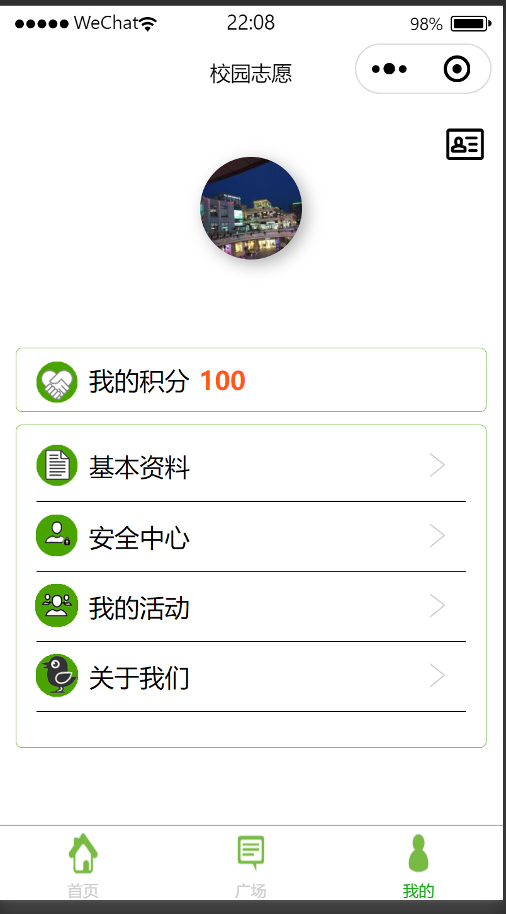

<h1 align="center">校园志愿者活动管理系统1</h1>

## 简介
校园志愿者活动管理系统：角色分为管理员和用户；提供活动发布、报名管理、积分查询、个人信息管理等功能，简化志愿者参与流程，提升校园志愿服务效率。    --计算机毕业设计源码；毕设源码；java毕业设计源码

## 联系方式

<h3 align="center">获取完整代码与数据库文件 + 微信：bysj5151 QQ: 86050149 QQ群: 783742310</h3>

<h3 align="center">可帮忙远程部署 包运行成功！提供远程部署、修改代码、设计文档指导、代码讲解等服务！</h3>

## 功能介绍（完整见运行截图）
管理员：负责管理整个系统，包括登录、注册和退出管理功能。同时还可以使用活动管理和志愿者管理功能模块，查看和统计每日、每月和历史活动发布数量，审核活动，维护志愿者数据，并通过“发布活动”界面添加新活动。管理系统的内容包括活动图片上传、积分设置和用户查询等。

用户：注册和登录以查看和报名参与志愿活动。用户可以访问个人主页查看积分、管理个人信息和参与的活动。活动界面上提供详细活动信息，如时间、地点和名额，帮助用户快速查找和报名志愿活动。此外，用户可以在“广场”页面浏览活动介绍和新闻，并通过“首页”、“广场”和“我的”导航栏方便地在不同功能之间切换。

组织者：通过“发布活动”页面，组织者可以输入活动标题、主办方、时间、地点等详细信息，设置活动积分和允许的申请人数，上传活动logo，并提交发布活动。此界面易于操作，旨在帮助活动发起者简化信息发布和活动管理流程。

志愿者：通过手机或网页端访问系统，寻找并参与志愿服务活动。志愿者可以查看当前参与的活动、申请加入新的活动，以及通过积分系统追踪志愿服务实践情况。通过活动详情界面，志愿者可以快速了解活动内容及状态，并使用系统提供的通讯功能联系组织者。

## 运行截图

本代码来源于网络,仅供学习参考使用!

